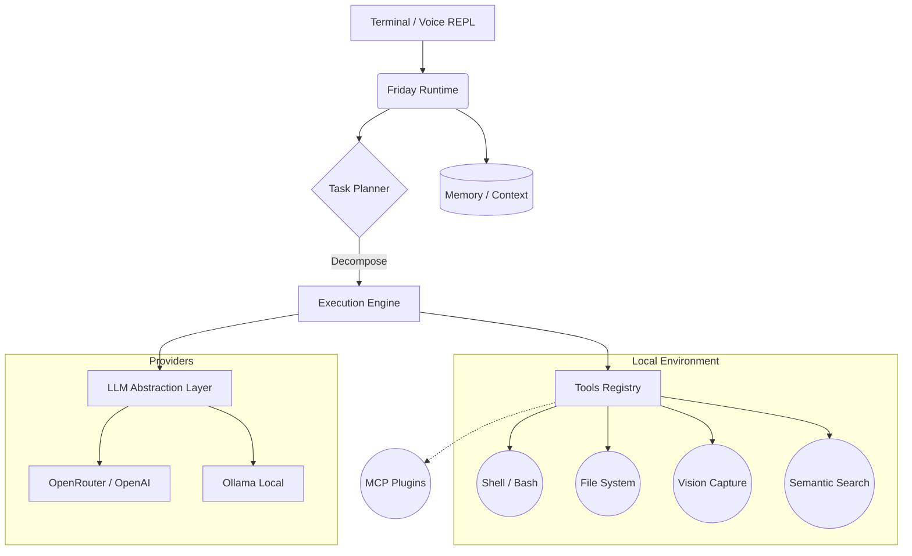

<div align="center">

# 🤖 Friday
**The Next-Generation Local AI Assistant for Developers.**

[](https://www.python.org/)
[](https://github.com/psf/black)
[](https://mypy-lang.org/)
[](LICENSE)

*«Friday is not just a chatbot. It is a reliable, autonomous AI assistant living on your computer, deeply integrated with your local files, tools, and workflows.»*

<br/>

[Features](#-key-features) •
[Architecture](#-architecture) •
[Installation](#-installation) •
[Usage](#-usage) •
[Roadmap](#-roadmap)

</div>

---

## ✨ Key Features

Friday brings the power of agentic AI directly to your desktop, offering an unparalleled developer experience through a suite of advanced subsystems.

### 🧠 Autonomous Execution Engine
Friday doesn't just answer questions; it acts. The built-in **Task Planner** breaks down complex, ambiguous goals into actionable steps, executes them using local tools, and autonomously handles errors or unexpected behaviors along the way.

### 👁️ Vision & Context Awareness
Friday can see what you see. Using the `[vision]` subsystem, the assistant can take screenshots of your active monitors to understand visual context, debug UI issues, or analyze architecture diagrams.

### 🗣️ Voice Interaction
Type `/voice` and speak directly to Friday! Powered by advanced noise-filtering algorithms, the `[speech]` subsystem allows for hands-free, seamless communication during your workflow.

### 📚 RAG & Semantic Code Search
Never lose track of your codebase. Friday's `[rag]` subsystem uses a local `ChromaDB` vector database and `sentence-transformers` to index your workspace, allowing the AI to perform lightning-fast semantic searches across thousands of files.

### 🔌 MCP (Model Context Protocol) Support
Easily extend Friday's capabilities on the fly. Connect external databases, GitHub, Jira, or web search tools securely via MCP without altering the core source code.

### 💾 Persistent Dual-Memory
- **Conversation Memory:** Remembers the context of your current and past conversations.
- **Workspace Memory:** Maintains an understanding of your project's structure, tech stack, and conventions.

### 🔄 Flexible LLM Backends
Total freedom of choice. Run completely offline and free using local models via **Ollama**, or leverage state-of-the-art frontier models like `gpt-4o` and `claude-3.5-sonnet` via **OpenRouter** or direct API keys.

---

## 🏗️ Architecture

Friday is built on the principles of **reliability**, **modularity**, and **security**.



> [!NOTE]  
> **Security First:** Friday operates within strict boundaries. Command execution and file system access are logged, and potentially destructive actions can be configured to require explicit user approval.

---

## 🚀 Installation

### For Regular Users (Recommended)
You don't need Python or Node.js! Friday comes as a standalone native desktop application.

1. Go to the [Releases](https://github.com/Cristofervaltz/Friday/releases) page.
2. Download the latest `Friday_x.x.x_x64_setup.exe` installer.
3. Run the installer and launch Friday.

*Friday will run in your System Tray and bundle its own optimized AI engine (`friday-api.exe` sidecar).*

### For Developers (Source Code)

If you want to modify Friday or run the terminal REPL, you'll need **Python 3.12+** and **Node.js**.

1. **Clone the repository:**
   ```bash
   git clone https://github.com/Cristofervaltz/Friday.git
   cd Friday
   ```

2. **Python Backend Setup:**
   ```bash
   python -m venv .venv
   source .venv/bin/activate  # On Windows: .venv\Scripts\activate
   pip install --upgrade pip
   pip install -e .[gui,speech,vision,rag]
   ```

3. **Frontend (Tauri) Setup:**
   ```bash
   cd src/ui
   npm install
   npm run tauri dev
   ```

---

## ⚙️ Configuration

Friday is designed to be user-friendly. **You do not need to touch `.env` files** unless you are developing!

1. Open the **Friday Desktop App**.
2. Click the **Settings (Gear)** icon in the sidebar.
3. Choose your LLM Provider (e.g., `openai`, `ollama`, `openrouter`).
4. Enter your API Key and Model name.
5. Click **Save Settings**. 

*Thanks to **Hot-Reloading**, Friday will apply your new configuration instantly without needing to restart!*

<details>
<summary><b>🔧 Configure OpenRouter (GPT-4, Claude)</b></summary>

```env
FRIDAY_LLM_PROVIDER=openrouter
FRIDAY_LLM_API_KEY=sk-or-v1-...
FRIDAY_LLM_MODEL=openai/gpt-4o
```
</details>

<details>
<summary><b>🔧 Configure Ollama (Local, Free)</b></summary>

```env
FRIDAY_LLM_PROVIDER=ollama
FRIDAY_LLM_MODEL=llama3
FRIDAY_LLM_BASE_URL=http://localhost:11434
```
</details>

---

## 💻 Usage

### 1. Native Desktop App (Tauri + React)
The easiest way to use Friday is via the Desktop Application.
- **System Tray:** Friday runs quietly in the background. Right-click the tray icon to exit or open the Dashboard.
- **Glassmorphism UI:** A beautiful, responsive interface that feels native to your OS.
- **Standalone:** No terminal windows left open, the Python sidecar is completely hidden.

### 2. Terminal Mode (For Hackers)
If you prefer the command line, you can start the interactive REPL:

```bash
friday
```

Inside the REPL, you can use the following slash commands:
- `/voice` - Activate microphone and speak your request.
- `/clear` - Clear the current conversation context.
- `/exit` or `/quit` - Safely shut down Friday.

---

## 🗺️ Roadmap

Friday is actively evolving. We are currently implementing features across several major stages, including a background Daemon Mode, a Desktop GUI, and proactive CI/CD monitoring.

Check out our full detailed [Future Roadmap](future_roadmap.md) to see what's coming next!

---

## 🛠️ For Developers

Contributions are highly welcome! We maintain strict code quality standards to ensure a robust foundation.

```bash
# Install development dependencies
pip install -e .[dev,speech,vision,rag]

# Run the test suite
python -m pytest

# Check code formatting & linting
black .
ruff check .

# Check static typing
mypy src tests
```

> [!TIP]
> Ensure all GitHub Actions CI checks pass before submitting a Pull Request.

---

<div align="center">
  <p>Made with ❤️ by the Friday Contributors.</p>
  <p>Licensed under the <a href="LICENSE">MIT License</a>.</p>
</div>
