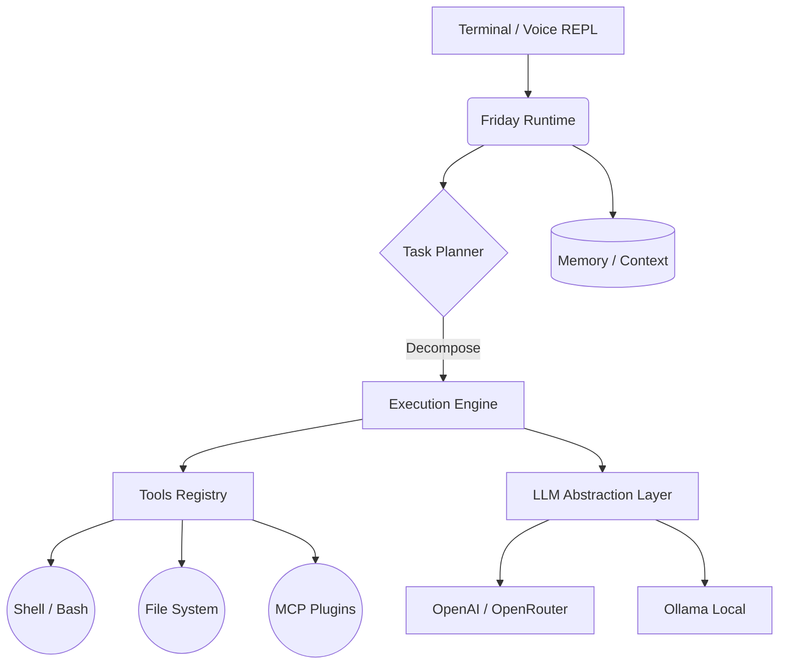

<div align="center">

# 🤖 Friday
**Ваш локальный ИИ-ассистент для автоматизации рутины и разработки.**

[](https://www.python.org/)
[](LICENSE)
[]()
[](https://github.com/psf/black)

*«Friday — это не просто чат-бот. Это надежный ИИ-помощник, живущий на вашем компьютере, имеющий доступ к вашим локальным файлам и инструментам, и способный выполнять реальные задачи.»*

</div>

---

## ✨ Ключевые возможности (v0.3.0)

- 🧠 **Автономный Планировщик (Task Planner)** — Friday умеет разбивать сложные задачи на шаги и выполнять их последовательно, контролируя ошибки на каждом этапе.
- 🗣️ **Распознавание речи** — общайтесь с Friday голосом! Нажмите `/voice`, и ассистент вас услышит, используя продвинутые алгоритмы фильтрации шума.
- 🔌 **Поддержка MCP (Model Context Protocol)** — Friday умеет безопасно подключать внешние инструменты (базы данных, GitHub, поиск) "на лету" без изменения исходного кода ядра.
- 💾 **Долгосрочная память** — встроенная подсистема `Conversation Memory` и `Workspace Memory` позволяет ассистенту "помнить" контекст ваших проектов между сессиями.
- 🔄 **Локальные и Облачные LLM** — полная свобода выбора. Используйте мощь `gpt-4o` (через OpenAI/OpenRouter) или бесплатные локальные модели через `Ollama`.
- 🛡️ **Безопасная архитектура** — строгий контроль над выполнением команд и доступом к файловой системе.

---

## 🏗️ Архитектура

Friday построен на принципах **надежности**, **чистоты кода** и **расширяемости**.



---

## 🚀 Установка и запуск

### Требования
- Python 3.12 или новее
- [Ollama](https://ollama.com/) (опционально, если хотите использовать локальные модели)

### Шаги

1. **Клонируйте репозиторий:**
   ```bash
   git clone https://github.com/Cristofervaltz/Friday.git
   cd Friday
   ```

2. **Создайте виртуальное окружение и установите зависимости:**
   ```bash
   python -m venv .venv
   source .venv/bin/activate  # Для Windows: .venv\Scripts\activate
   pip install --upgrade pip
   
   # Базовая установка:
   pip install -e .
   
   # Установка с поддержкой голосовых команд:
   pip install -e .[speech]
   ```

3. **Настройте переменные окружения:**
   Скопируйте пример файла конфигурации:
   ```bash
   cp .env.example .env
   ```
   
   Откройте `.env` и настройте вашего провайдера:
   
   **Для Ollama (Бесплатно, локально):**
   ```env
   FRIDAY_LLM_PROVIDER=ollama
   FRIDAY_LLM_MODEL=llama3
   FRIDAY_LLM_BASE_URL=http://localhost:11434
   ```

   **Для OpenRouter (Доступ к GPT-4, Claude):**
   ```env
   FRIDAY_LLM_PROVIDER=openrouter
   FRIDAY_LLM_API_KEY=sk-or-v1-...
   FRIDAY_LLM_MODEL=openai/gpt-4o
   ```

4. **Запуск:**
   ```bash
   friday
   ```

---

## 🛠️ Для разработчиков

Friday спроектирован так, чтобы в него было легко контрибьютить. Весь код типизирован (`mypy`) и отформатирован (`black`, `ruff`).

### Проверка качества кода:
```bash
python -m pytest
black .
ruff check .
mypy src tests
```

---

## 📄 Лицензия

Проект распространяется под лицензией [MIT License](LICENSE). 
Сделано с ❤️ для разработчиков.
