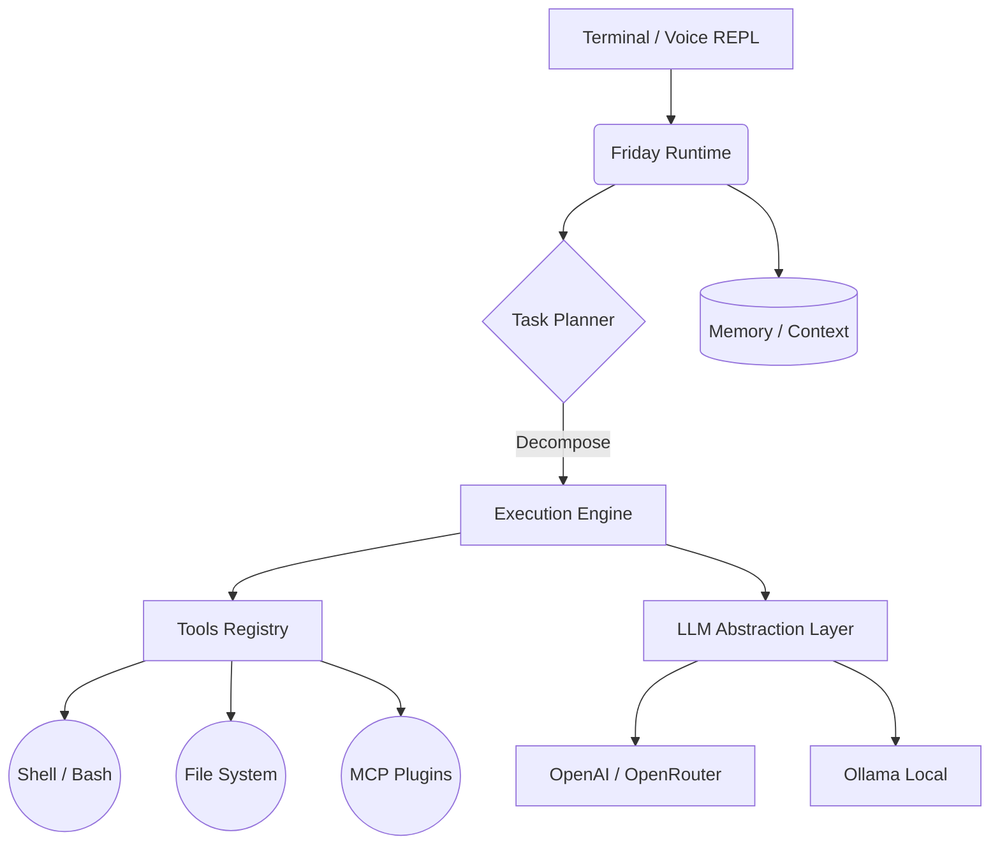

<div align="center">

# 🤖 Friday
**Your local AI assistant for routine automation and development.**

[](https://www.python.org/)
[](LICENSE)
[]()
[](https://github.com/psf/black)

*«Friday is not just a chatbot. It is a reliable AI assistant living on your computer, with access to your local files and tools, capable of executing real tasks.»*

</div>

---

## ✨ Key Features (v0.3.0)

- 🧠 **Autonomous Task Planner** — Friday can decompose complex tasks into steps and execute them sequentially, handling errors at each stage.
- 🗣️ **Speech Recognition** — Communicate with Friday using your voice! Type `/voice` and the assistant will listen, using advanced noise filtering algorithms.
- 🔌 **MCP (Model Context Protocol) Support** — Friday can safely connect external tools (databases, GitHub, web search) on the fly without changing the core source code.
- 💾 **Long-term Memory** — Built-in `Conversation Memory` and `Workspace Memory` subsystems allow the assistant to "remember" your project context across sessions.
- 🔄 **Local and Cloud LLMs** — Complete freedom of choice. Use the power of `gpt-4o` (via OpenAI/OpenRouter) or free local models via `Ollama`.
- 🛡️ **Secure Architecture** — Strict control over command execution and file system access.

---

## 🏗️ Architecture

Friday is built on the principles of **reliability**, **clean code**, and **extensibility**.



---

## 🚀 Installation and Setup

### Requirements
- Python 3.12 or newer
- [Ollama](https://ollama.com/) (optional, if you want to use local models)

### Steps

1. **Clone the repository:**
   ```bash
   git clone https://github.com/Cristofervaltz/Friday.git
   cd Friday
   ```

2. **Create a virtual environment and install dependencies:**
   ```bash
   python -m venv .venv
   source .venv/bin/activate  # For Windows: .venv\Scripts\activate
   pip install --upgrade pip
   
   # Basic installation:
   pip install -e .
   
   # Installation with voice command support:
   pip install -e .[speech]
   ```

3. **Configure environment variables:**
   Copy the example configuration file:
   ```bash
   cp .env.example .env
   ```
   
   Open `.env` and configure your provider:
   
   **For Ollama (Free, local):**
   ```env
   FRIDAY_LLM_PROVIDER=ollama
   FRIDAY_LLM_MODEL=llama3
   FRIDAY_LLM_BASE_URL=http://localhost:11434
   ```

   **For OpenRouter (Access to GPT-4, Claude):**
   ```env
   FRIDAY_LLM_PROVIDER=openrouter
   FRIDAY_LLM_API_KEY=sk-or-v1-...
   FRIDAY_LLM_MODEL=openai/gpt-4o
   ```

4. **Run:**
   ```bash
   friday
   ```

---

## 🛠️ For Developers

Friday is designed to be easy to contribute to. All code is typed (`mypy`) and formatted (`black`, `ruff`).

### Code Quality Checks:
```bash
python -m pytest
black .
ruff check .
mypy src tests
```

---

## 📄 License

This project is licensed under the [MIT License](LICENSE). 
Made with ❤️ for developers.
