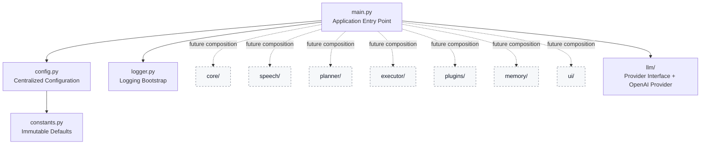

# Friday

**Friday** is a developer-focused automation assistant foundation with a production-ready LLM abstraction layer.

This repository establishes the engineering baseline for a future desktop automation assistant. The current release focuses on architecture, configuration, logging, project standards, and a clean language-model integration boundary that the rest of the application can depend on safely.

> Friday is **not** ChatGPT.
> Friday is **not** a general-purpose chatbot framework.
> Friday is being designed as a **desktop automation assistant** whose long-term purpose is to execute real actions on a developer's computer.
> The current release includes only the low-level LLM communication layer, not planner, memory, tools, or agent behavior.

## Project overview

Friday aims to become a trustworthy developer companion with a strong emphasis on clarity, safety, maintainability, and explicit system boundaries. Instead of shipping speculative intelligence too early, v0.0.1 delivers a clean, scalable repository structure that future contributors can confidently build upon.

This initial version includes:

- a modern Python 3.12+ project layout
- centralized configuration based on dataclasses
- reusable application logging with console and rotating file handlers
- a unified `src.llm` abstraction layer for language-model providers
- an OpenAI-compatible provider with validation, timeouts, and dedicated exceptions
- quality tooling with Black, Ruff, MyPy, and Pytest
- CI automation for style, type, and test validation
- contributor documentation and open-source repository standards

## Philosophy

Friday is built around a few core principles.

### 1. Foundation before features
A serious automation product needs clear boundaries, predictable configuration, and strong operational visibility before advanced behavior is introduced.

### 2. Explicit system design
Future capabilities such as UI integration, planning, memory, execution, and speech should evolve behind stable module boundaries rather than accumulating as ad-hoc scripts.

### 3. Safety by omission
Potentially risky capabilities are intentionally excluded in v0.0.1. Friday includes only direct request/response communication with an LLM provider. There is still no command execution, no intent recognition, no automation engine, and no agent runtime.

### 4. Open-source professionalism
The repository should feel publishable from day one: documented, tested, formatted, typed, and easy to contribute to.

## Architecture diagram



### Architectural intent
The current application starts, loads configuration, initializes logging, and exposes an LLM subsystem that future CLI, planner, or automation layers can call through a stable provider interface. Higher-level assistant behavior remains intentionally out of scope.

## Runtime Core

Friday uses a centralized `FridayApplication` class to manage the application lifecycle. This Runtime Core is responsible for:

- Loading configuration from environment
- Creating required runtime directories
- Configuring the logging subsystem
- Initializing the LLM provider
- Managing shutdown and cleanup

### Usage

```python
from src.runtime import FridayApplication

app = FridayApplication()
app.initialize()
exit_code = app.run()
app.shutdown()
```

The `main.py` entry point is now minimal:

```python
def main() -> int:
    app = FridayApplication()
    app.initialize()
    return app.run()
```

### Benefits

- **Single initialization point** — all subsystems are initialized through Runtime
- **Dependency management** — components access shared instances via Runtime properties (`config`, `logger`, `provider`)
- **Extensibility** — future subsystems (memory, plugins, tools, sessions) will register with Runtime
- **Error safety** — failed initialization triggers proper cleanup
- **Testability** — Runtime lifecycle is fully covered by tests

## Project goals

### Current goals for v0.0.1

- establish a professional repository baseline
- define scalable package boundaries
- centralize operational configuration
- provide reliable logging for future runtime observability
- introduce a stable LLM provider contract for future integrations
- enforce formatting, linting, typing, and test discipline
- make contribution and release workflows easy to understand

### Non-goals for v0.0.1

The following are intentionally out of scope:

- streaming responses
- chat history
- planners
- plugins
- memory systems
- command execution
- wake word handling
- speech recognition
- automation routines
- desktop control logic
- tool or function calling
- vision, audio, and embeddings

## Installation

### Requirements

- Python 3.12 or newer
- pip
- virtual environment support

### Setup

```bash
git clone https://github.com/Cristofervaltz/Friday.git
cd Friday
python -m venv .venv
source .venv/bin/activate  # Windows: .venv\Scripts\activate
pip install --upgrade pip
pip install -r requirements.txt
```

### Configuration

Friday uses environment variables for configuration. Create a `.env` file:

```bash
cp .env.example .env
```

Edit `.env` and configure your LLM provider:

**For OpenRouter:**
```bash
FRIDAY_LLM_PROVIDER=openrouter
FRIDAY_LLM_API_KEY=sk-or-v1-your-key-here
FRIDAY_LLM_MODEL=openai/gpt-4-turbo
```

**For Ollama (local):**
```bash
FRIDAY_LLM_PROVIDER=ollama
FRIDAY_LLM_MODEL=llama2
FRIDAY_LLM_BASE_URL=http://localhost:11434
```

**Important:** Never commit `.env` file! It's in `.gitignore` for your safety.

### Run Examples

```bash
python examples/runtime_with_openrouter.py
```

See [examples/README.md](examples/README.md) for more.

## Project structure

```text
Friday/
├── .github/
│   ├── ISSUE_TEMPLATE/
│   └── workflows/
├── assets/
├── docs/
├── examples/
├── scripts/
├── src/
│   ├── core/
│   ├── executor/
│   ├── llm/
│   │   ├── __init__.py
│   │   ├── base.py
│   │   ├── exceptions.py
│   │   ├── openai_provider.py
│   │   └── provider.py
│   ├── memory/
│   ├── planner/
│   ├── plugins/
│   ├── runtime/
│   │   ├── __init__.py
│   │   └── application.py
│   ├── speech/
│   ├── ui/
│   ├── __init__.py
│   ├── config.py
│   ├── constants.py
│   ├── logger.py
│   └── main.py
├── tests/
├── CHANGELOG.md
├── CONTRIBUTING.md
├── LICENSE
├── ROADMAP.md
├── README.md
├── pyproject.toml
└── requirements.txt
```

## Repository highlights

### `src/runtime/application.py`
Central application lifecycle manager. All subsystems are initialized, accessed, and shut down through `FridayApplication`.

### `src/config.py`
Provides strongly typed application configuration using dataclasses and environment-aware loading patterns.

### `src/logger.py`
Provides a reusable singleton logger factory with console output, rotating file logs, timestamps, and configurable levels.

### `tests/`
Covers the bootstrap foundation, runtime lifecycle, and LLM abstraction layer so regressions are caught before higher-level assistant features land.

### `.github/workflows/ci.yml`
Runs formatting, linting, typing, and tests on every push and pull request.

## LLM subsystem

### Supported Providers

Friday supports multiple LLM providers through a unified interface:

- **OpenAI** — Official OpenAI API (GPT-4, GPT-3.5, etc.)
- **OpenRouter** — Access to multiple providers (OpenAI, Anthropic, Google, etc.) through one API
- **Ollama** — Local LLM hosting (also compatible with LM Studio)

### Architecture
The `src.llm` package defines a single provider contract for the rest of Friday:

- `BaseLLMProvider` describes the common interface
- `OpenAIProvider` implements OpenAI-compatible backends
- `OpenRouterProvider` provides access to multiple LLM providers
- `OllamaProvider` enables local model hosting
- `exceptions.py` isolates provider failures behind Friday-specific exception types
- `provider.py` exposes a compatibility alias for the generic provider type

The rest of the application should depend on `generate(prompt: str) -> str` rather than on vendor-specific SDKs or payload formats.

### Provider interface

```python
from src.llm import BaseLLMProvider


def ask(provider: BaseLLMProvider, prompt: str) -> str:
    return provider.generate(prompt)
```

### Configuration
Friday uses environment-backed configuration for LLM providers.

#### Environment Variables

- `FRIDAY_LLM_PROVIDER` — Provider type: `openai`, `openrouter`, or `ollama`
- `FRIDAY_LLM_API_KEY` — API key (not required for Ollama)
- `FRIDAY_LLM_BASE_URL` — Custom API endpoint (optional)
- `FRIDAY_LLM_MODEL` — Model identifier
- `FRIDAY_LLM_TIMEOUT` — Request timeout in seconds (default: 30)

#### OpenAI Example

```python
import os
os.environ["FRIDAY_LLM_PROVIDER"] = "openai"
os.environ["FRIDAY_LLM_API_KEY"] = "sk-..."
os.environ["FRIDAY_LLM_MODEL"] = "gpt-4"

from src.runtime import FridayApplication

app = FridayApplication()
app.initialize()
response = app.provider.generate("Hello!")
print(response)
app.shutdown()
```

#### OpenRouter Example

```python
import os
os.environ["FRIDAY_LLM_PROVIDER"] = "openrouter"
os.environ["FRIDAY_LLM_API_KEY"] = "sk-or-v1-..."
os.environ["FRIDAY_LLM_MODEL"] = "openai/gpt-4-turbo"

from src.runtime import FridayApplication

app = FridayApplication()
app.initialize()
response = app.provider.generate("What is Friday?")
print(response)
app.shutdown()
```

#### Ollama Example (Local)

```python
import os
os.environ["FRIDAY_LLM_PROVIDER"] = "ollama"
os.environ["FRIDAY_LLM_MODEL"] = "llama2"
os.environ["FRIDAY_LLM_BASE_URL"] = "http://localhost:11434"

from src.runtime import FridayApplication

app = FridayApplication()
app.initialize()
response = app.provider.generate("Hello Friday!")
print(response)
app.shutdown()
```

#### Direct Provider Usage

You can also use providers directly without Runtime:

```python
from src.llm import OpenRouterProvider

provider = OpenRouterProvider(
    api_key="sk-or-v1-...",
    model="anthropic/claude-3-sonnet",
)

response = provider.generate("Explain Friday in one sentence.")
print(response)
```

More examples available in the `examples/` directory.

### Adding new providers
Add one new file under `src/llm/`, implement `BaseLLMProvider`, and register it in the Runtime provider factory.

Examples of future providers:

- `AnthropicProvider` (native Anthropic API)
- `GeminiProvider` (Google's Gemini)
- `AzureOpenAIProvider` (Azure-hosted OpenAI)

No existing provider implementation should need modification.

## Roadmap summary

A detailed version-by-version plan is available in [ROADMAP.md](ROADMAP.md). The short version:

- **v0.0.1** — foundation, logging, config, repository standards
- **v0.0.2** — stronger domain boundaries and bootstrap lifecycle patterns
- **v0.0.3** — richer app state and diagnostics infrastructure
- **v0.1** — initial desktop-facing shell and internal service contracts
- **v0.2** — safe automation abstractions
- **v0.3** — extensibility preparation
- **v0.5** — user-facing interaction layer foundations
- **v1.0** — first stable automation companion release

## Future plans

Friday is intended to evolve toward a desktop automation assistant for developers. Future releases may include:

- structured service orchestration
- desktop event integration
- secure action execution boundaries
- UI surfaces for status and controls
- plugin lifecycle contracts
- speech and multimodal extension points
- planning and orchestration systems

Those features will only be introduced when the surrounding architecture is mature enough to support them safely.

## Development workflow

### Quality checks

```bash
python -m black --check .
python -m ruff check .
python -m mypy src tests
python -m pytest
```

### Helpful script

```bash
./scripts/quality.sh
```

## Contribution guide

Contributions are welcome, especially around architecture, quality, documentation, and operational readiness.

1. Read [CONTRIBUTING.md](CONTRIBUTING.md).
2. Create a feature branch from `develop`.
3. Keep changes focused and well-tested.
4. Run the full quality suite before opening a pull request.
5. Document architectural decisions clearly.

## License

This project is released under the [MIT License](LICENSE).

## Release status

**Current release: v0.0.1**

Friday is intentionally minimal at this stage. The codebase now includes a small, production-ready LLM transport layer, but higher-level assistant behavior is still intentionally absent while the project continues to establish safe system boundaries.
