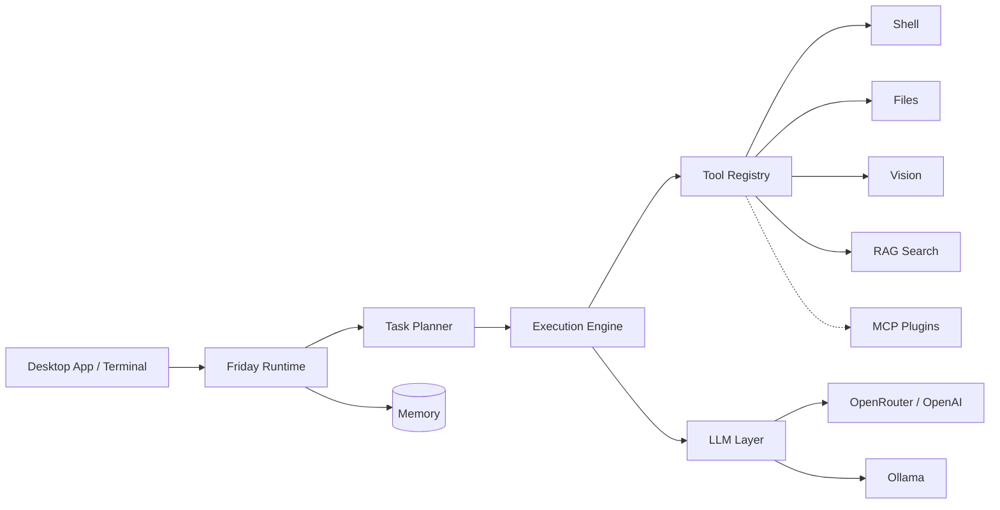

<div align="center">
  

# Friday

**Your local AI assistant that actually does things.**

[](https://github.com/Cristofervaltz/Friday/releases)
[](https://github.com/Cristofervaltz/Friday/actions)
[](https://python.org)
[](LICENSE)

[](README.md)
[](README_ru.md)

Friday is an open-source, autonomous AI assistant that lives on your machine.  
It reads your files, runs your commands, searches your codebase, listens to your voice — and does it all through a native desktop app or a terminal.

<br/>

[Download](#-download) · [Features](#-what-it-can-do) · [Skills](#-custom-skills) · [Setup for Devs](#-building-from-source) · [Architecture](#%EF%B8%8F-architecture) · [Roadmap](#%EF%B8%8F-roadmap)

</div>

<br/>

## 📥 Download

**No Python. No Node.js. No terminal. Just install and go.**

1. Head to the **[Releases](https://github.com/Cristofervaltz/Friday/releases)** page.
2. Grab the latest `.msi` or `.exe` installer.
3. Run it. Friday appears in your system tray — ready to work.

The desktop app is built with [Tauri](https://tauri.app/) and ships with a bundled Python sidecar, so everything runs out of the box.

---

## ✨ What It Can Do

| Capability | How it works |
|---|---|
| **Autonomous task execution** | Give Friday a goal. It breaks it down, runs shell commands, edits files, handles errors — all on its own. |
| **Interactive Permissions** | Total control over Friday's actions. Approve every shell command or file operation via an aesthetic UI, set custom whitelists, or use Turbo mode. |
| **Multi-Agent Swarms** | Use `/swarms` to delegate complex tasks to specialized, concurrently running sub-agents (e.g. 'Coder', 'Researcher'). |
| **Custom Native Skills** | Drop a `.md` file into `~/.friday/skills` — it instantly becomes a slash command with zero coding. [Learn more ↓](#-custom-skills) |
| **Background Tasks** | Use `/goal` for infinite autonomous loops or `/schedule` for cron-based background execution. |
| **Smart Action Button** | The send button transforms into **Stop** while Friday is busy, and into **Queue** when you start typing mid-task. |
| **Agent Dashboard** | See what the agent is thinking, what tools it's calling, and its execution plan in real-time. |
| **Rich Artifacts Viewer** | Renders Mermaid diagrams, code diffs, and structured outputs natively inside the app. |
| **Voice input** | Press `Ctrl+Alt+Space` or say **"Friday"** / **"Hey Friday"** / **"Пятница"** from anywhere to talk to the assistant. |
| **Vision** | Friday takes screenshots and analyzes them — debug UI bugs, read diagrams, understand context. |
| **Semantic code search (RAG)** | Your entire workspace is indexed locally with ChromaDB. Ask questions about code in natural language. |
| **Plugins & MCP** | Extend Friday with Model Context Protocol servers — GitHub, Jira, databases, web search. |
| **Dual memory** | Conversation history + persistent workspace knowledge. |
| **Any LLM** | OpenAI, Claude via OpenRouter, or fully offline with Ollama (with Native Tool Calling). Switch models on the fly. |
| **Fault-Tolerant** | Gracefully handles LLM network drops, repairs broken JSON responses, and prevents Unicode crashes. |

---

## 🧠 Custom Skills

The most powerful way to personalise Friday. Teach her a role, a style, a context — anything you need.

**How it works:**

1. Create a `.md` file anywhere in `~/.friday/skills/`
2. Write your system instructions inside — role, tone, constraints, context
3. Friday picks it up automatically. No restart required.

Type `/` in the chat input to open the skills menu and see all available commands:

```
/reviewer   → activates code review mode
/architect  → switches Friday into system design mode
/writer     → enables technical documentation style
/your-skill → whatever you create
```

Skills are injected directly into the agent's system context the moment you trigger them. They stack with Friday's built-in capabilities — vision, RAG, tools — everything still works.

---

## ⚙️ Configuration

Everything is configured **inside the app**. No `.env` files needed.

1. Open Friday → click the **⚙ gear icon** in the sidebar.
2. Pick your provider (`openai` / `openrouter` / `ollama`).
3. Paste your API key, choose a model.
4. Hit **Save**.

> 💡 **Tip for free top-tier LLMs:** Use [OmniRoute](https://github.com/diegosouzapw/OmniRoute) — the easiest way to connect frontier models to Friday without expensive API keys. Run it locally and point Friday to its endpoint.

Changes apply instantly via hot-reload — no restart required.

<details>
<summary>🔧 Advanced: environment variables (for terminal/headless mode)</summary>

```bash
cp .env.example .env
```

| Variable | Example | Description |
|---|---|---|
| `FRIDAY_LLM_PROVIDER` | `openrouter` | LLM backend |
| `FRIDAY_LLM_API_KEY` | `sk-or-v1-...` | Your API key |
| `FRIDAY_LLM_MODEL` | `openai/gpt-4o` | Model identifier |
| `FRIDAY_LLM_BASE_URL` | `http://localhost:11434` | Custom endpoint (Ollama) |

</details>

---

## 🏗️ Architecture

```
Friday
├── src/
│   ├── api/          # FastAPI backend (sidecar engine)
│   ├── cli/          # Terminal REPL interface
│   ├── core/         # Agent loop & orchestration
│   ├── daemon/       # System tray, hotkeys, file watchers
│   ├── executor/     # Sandboxed command & file execution
│   ├── llm/          # LLM abstraction (OpenAI, Ollama, OpenRouter)
│   ├── memory/       # Conversation + workspace memory
│   ├── planner/      # Task decomposition & autonomous planning
│   ├── plugins/      # MCP plugin manager
│   ├── retrieval/    # RAG with ChromaDB + sentence-transformers
│   ├── speech/       # Voice recognition subsystem
│   ├── tools/        # Built-in tool registry
│   ├── ui/           # Tauri + React + Vite frontend
│   └── vision/       # Screenshot capture & analysis
├── tests/            # 189 tests, fully typed
└── pyproject.toml
```



> **Security:** All command execution and file access is logged. Destructive operations can require explicit user approval.

---

## 💻 Usage

### Desktop App
The primary way to use Friday. Runs as a native window with a glassmorphism dark-theme UI. The Python backend operates invisibly as a sidecar process — no terminal windows, no setup.

### Slash Commands
Type `/` in the chat input to open the command menu:

| Command | Action |
|---|---|
| `/voice` | Speak your request |
| `/goal` | Start an infinite autonomous task loop |
| `/schedule` | Run a command on a cron schedule |
| `/swarms` | Delegate task to multi-agent sub-agents |
| `/<skill>` | Trigger any custom skill from `~/.friday/skills` |
| `/clear` | Reset conversation |
| `/exit` | Shut down |

### Voice & Background Daemon
Friday runs quietly in your system tray and listens for voice commands system-wide.
- **Wake Words:** Say **"Friday"**, **"Hey Friday"**, **"Пятница"**, or **"Эй, пятница"** from anywhere.
- **Global Hotkey:** Press `Ctrl+Alt+Space` to instantly activate voice input.

### Terminal REPL
For those who prefer the command line:

```bash
friday
```

---

## 🔨 Building from Source

<details>
<summary><b>Prerequisites</b></summary>

- Python 3.12+
- Node.js 18+
- Rust toolchain (for Tauri)

</details>

```bash
# Clone
git clone https://github.com/Cristofervaltz/Friday.git && cd Friday

# Python backend
python -m venv .venv
.venv\Scripts\activate        # Linux/macOS: source .venv/bin/activate
pip install -e .[gui,speech,vision,rag,dev]

# Frontend (Tauri)
cd src/ui && npm install

# Build the Python sidecar executable (required for production build)
# python scripts/build_sidecar.py

npm run tauri dev              # Development mode (uses local python)
npm run tauri build            # Production .exe installer (requires sidecar)
```

The desktop app bundles the Python backend into a highly optimized sidecar (`friday-api.exe`), meaning end-users don't need Python installed. It also features:
- **In-App Settings:** Configure API keys, models, and providers directly via a beautiful UI modal.
- **Task Queue & Instant Send:** View queued tasks and click ⚡ to immediately jump a task to the front of the queue.
- **Workspace Selector:** Set active context directories directly from the header dropdown.
- **Hot-Reloading:** Change your LLM or API keys and apply them instantly without restarting.
- **Native System Tray:** Runs quietly in the background and can be summoned anytime.

### Running CI checks locally

```bash
black .          # Formatting
ruff check .     # Linting
mypy src tests   # Type checking
pytest           # 189 tests
```

---

## 🗺️ Roadmap

| Stage | Status |
|---|---|
| Core runtime, LLM abstraction, memory | ✅ Done |
| Task planner & autonomous execution | ✅ Done |
| Speech recognition | ✅ Done |
| Plugin system & MCP support | ✅ Done |
| Vision & RAG (semantic code search) | ✅ Done |
| Background daemon & system triggers | ✅ Done |
| Native desktop app (Tauri) | ✅ Done |
| In-app settings & hot-reload config | ✅ Done |
| Fault-Tolerance & Ollama Native Tool Calling | ✅ Done |
| Custom Skills & slash command menu | ✅ Done |
| Global integrations & expansion | 🚧 Next |

See the full [development roadmap](future_roadmap.md) for details.

---

## 🤝 Contributing

Contributions welcome. The project uses strict linting and 100% CI enforcement:

- **Black** for formatting
- **Ruff** for linting
- **mypy** (strict mode) for type safety
- **pytest** for tests

All checks must pass before merge. See the [CI workflow](.github/workflows/ci.yml).

---

<div align="center">
<sub>Open source · MIT License · Made by <a href="https://github.com/Cristofervaltz">@Cristofervaltz</a></sub>
</div>
