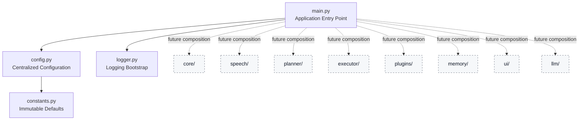

# Friday

**Friday** is an AI Development Companion for developers — but **v0.0.1 is intentionally not an AI product**.

This repository establishes the production-grade engineering foundation for a future desktop automation assistant. The current release focuses exclusively on architecture, configuration, logging, project standards, and contributor experience.

> Friday is **not** ChatGPT.
> Friday is **not** a chatbot.
> Friday is being designed as a **desktop automation assistant** whose long-term purpose is to execute real actions on a developer's computer.
> The current release deliberately stops far short of those capabilities.

## Project overview

Friday aims to become a trustworthy developer companion with a strong emphasis on clarity, safety, maintainability, and explicit system boundaries. Instead of shipping speculative intelligence too early, v0.0.1 delivers a clean, scalable repository structure that future contributors can confidently build upon.

This initial version includes:

- a modern Python 3.12+ project layout
- centralized configuration based on dataclasses
- reusable application logging with console and rotating file handlers
- quality tooling with Black, Ruff, MyPy, and Pytest
- CI automation for style, type, and test validation
- contributor documentation and open-source repository standards

## Philosophy

Friday is built around a few core principles.

### 1. Foundation before features
A serious automation product needs clear boundaries, predictable configuration, and strong operational visibility before advanced behavior is introduced.

### 2. Explicit system design
Future capabilities such as UI integration, planning, memory, execution, and speech should evolve behind stable module boundaries rather than accumulating as ad-hoc scripts.

### 3. Safety by omission
Potentially risky capabilities are intentionally excluded in v0.0.1. There is no AI, no command execution, no intent recognition, and no automation engine.

### 4. Open-source professionalism
The repository should feel publishable from day one: documented, tested, formatted, typed, and easy to contribute to.

## Architecture diagram



### Architectural intent
The current application starts, loads configuration, initializes logging, and exits cleanly after announcing startup. Every other module namespace is present to make future development deliberate and incremental.

## Project goals

### Current goals for v0.0.1

- establish a professional repository baseline
- define scalable package boundaries
- centralize operational configuration
- provide reliable logging for future runtime observability
- enforce formatting, linting, typing, and test discipline
- make contribution and release workflows easy to understand

### Non-goals for v0.0.1

The following are intentionally out of scope:

- LLM integration
- AI behavior
- planners
- plugins
- memory systems
- command execution
- wake word handling
- speech recognition
- automation routines
- desktop control logic

## Installation

### Requirements

- Python 3.12 or newer
- pip
- virtual environment support

### Setup

```bash
git clone https://github.com/your-org/friday.git
cd friday
python -m venv .venv
source .venv/bin/activate  # Windows: .venv\Scripts\activate
pip install --upgrade pip
pip install -r requirements.txt
pip install -e .
```

### Run the minimal bootstrap

```bash
python -m src.main
```

## Project structure

```text
Friday/
├── .github/
│   ├── ISSUE_TEMPLATE/
│   └── workflows/
├── assets/
├── docs/
├── examples/
├── scripts/
├── src/
│   ├── core/
│   ├── executor/
│   ├── llm/
│   ├── memory/
│   ├── planner/
│   ├── plugins/
│   ├── speech/
│   ├── ui/
│   ├── __init__.py
│   ├── config.py
│   ├── constants.py
│   ├── logger.py
│   └── main.py
├── tests/
├── CHANGELOG.md
├── CONTRIBUTING.md
├── LICENSE
├── ROADMAP.md
├── README.md
├── pyproject.toml
└── requirements.txt
```

## Repository highlights

### `src/config.py`
Provides strongly typed application configuration using dataclasses and environment-aware loading patterns.

### `src/logger.py`
Provides a reusable singleton logger factory with console output, rotating file logs, timestamps, and configurable levels.

### `tests/`
Covers the bootstrap foundation so early regressions are caught before new features land.

### `.github/workflows/ci.yml`
Runs formatting, linting, typing, and tests on every push and pull request.

## Roadmap summary

A detailed version-by-version plan is available in [ROADMAP.md](ROADMAP.md). The short version:

- **v0.0.1** — foundation, logging, config, repository standards
- **v0.0.2** — stronger domain boundaries and bootstrap lifecycle patterns
- **v0.0.3** — richer app state and diagnostics infrastructure
- **v0.1** — initial desktop-facing shell and internal service contracts
- **v0.2** — safe automation abstractions
- **v0.3** — extensibility preparation
- **v0.5** — user-facing interaction layer foundations
- **v1.0** — first stable automation companion release

## Future plans

Friday is intended to evolve toward a desktop automation assistant for developers. Future releases may include:

- structured service orchestration
- desktop event integration
- secure action execution boundaries
- UI surfaces for status and controls
- plugin lifecycle contracts
- speech and multimodal extension points
- planning and orchestration systems

Those features will only be introduced when the surrounding architecture is mature enough to support them safely.

## Development workflow

### Quality checks

```bash
python -m black --check .
python -m ruff check .
python -m mypy src tests
python -m pytest
```

### Helpful script

```bash
./scripts/quality.sh
```

## Contribution guide

Contributions are welcome, especially around architecture, quality, documentation, and operational readiness.

1. Read [CONTRIBUTING.md](CONTRIBUTING.md).
2. Create a feature branch from `develop`.
3. Keep changes focused and well-tested.
4. Run the full quality suite before opening a pull request.
5. Document architectural decisions clearly.

## License

This project is released under the [MIT License](LICENSE).

## Release status

**Current release: v0.0.1**

Friday is intentionally minimal at this stage. The absence of automation and intelligence is a feature, not a gap: the project is establishing a serious engineering baseline before higher-risk capabilities are introduced.
