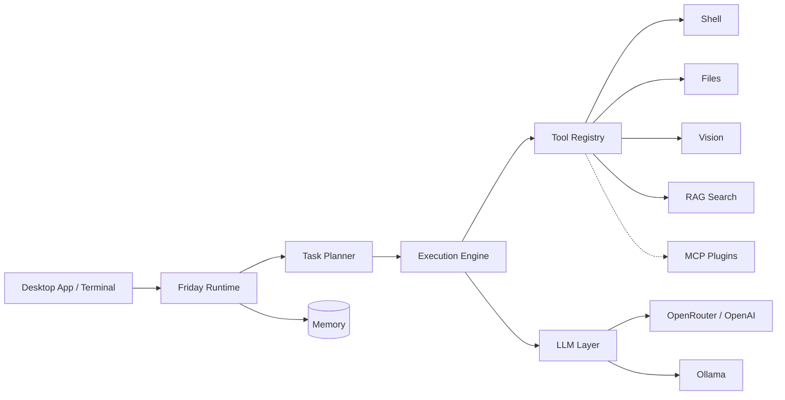

<div align="center">
  

# Friday

**Локальный ИИ-ассистент, который не просто общается — он выполняет реальные задачи на вашем компьютере.**

[](https://github.com/Cristofervaltz/Friday/releases)
[](https://github.com/Cristofervaltz/Friday/actions)
[](https://python.org)
[](LICENSE)

[](README.md)
[](README_ru.md)

Friday — это автономный ИИ-ассистент с открытым исходным кодом, который живёт прямо на вашей машине.  
Читает файлы, выполняет команды, ищет по кодовой базе, слушает голос — всё это через нативное десктопное приложение или терминал.

<br/>

[Скачать](#-скачать) · [Возможности](#-возможности) · [Навыки](#-навыки-skills) · [Настройка](#%EF%B8%8F-настройка) · [Архитектура](#%EF%B8%8F-архитектура) · [Роадмап](#%EF%B8%8F-роадмап)

</div>

<br/>

## 📥 Скачать

**Никаких установок Python, Node.js или терминала. Просто скачайте и запустите.**

1. Перейдите на страницу **[Releases](https://github.com/Cristofervaltz/Friday/releases)**.
2. Скачайте последний установщик `.msi` или `.exe`.
3. Запустите. Friday появится в системном трее — готова к работе.

Приложение собрано на [Tauri](https://tauri.app/) и поставляется со встроенным Python sidecar, так что всё работает сразу из коробки.

---

## ✨ Возможности

| Возможность | Как работает |
|---|---|
| **Автономное выполнение задач** | Дайте Friday цель. Она разобьёт её на шаги, выполнит команды, отредактирует файлы и справится с ошибками — самостоятельно. |
| **Интерактивные разрешения** | Полный контроль над действиями Friday. Подтверждайте каждую команду или операцию с файлами, настройте белые списки или используйте режим Turbo. |
| **Мультиагентный рой** | Используйте `/swarms` для делегирования сложных задач специализированным параллельным агентам (например, «Coder», «Researcher»). |
| **Пользовательские навыки** | Положите `.md`-файл в `~/.friday/skills` — он мгновенно станет slash-командой без единой строки кода. [Подробнее ↓](#-навыки-skills) |
| **Фоновые задачи** | `/goal` для бесконечных автономных циклов, `/schedule` — для выполнения задач по cron-расписанию. |
| **Умная кнопка действия** | Кнопка отправки превращается в **Stop**, пока Friday занята, и в **Queue**, если вы начинаете печатать следующую мысль в процессе. |
| **Панель агента** | Следите в реальном времени за тем, что думает агент, какие инструменты вызывает и как планирует выполнение. |
| **Просмотр артефактов** | Нативная отрисовка диаграмм Mermaid, diff-блоков кода и структурированных данных прямо в интерфейсе. |
| **Голосовой ввод** | Нажмите `Ctrl+Alt+Space` или скажите **«Пятница»** / **«Эй, пятница»** / **«Friday»** из любого места — и ассистент вас услышит. |
| **Зрение (Vision)** | Friday делает скриншоты и анализирует их — отлаживает UI, читает диаграммы, понимает контекст. |
| **Семантический поиск по коду (RAG)** | Вся кодовая база индексируется локально через ChromaDB. Задавайте вопросы о коде на естественном языке. |
| **Плагины и MCP** | Расширяйте Friday через серверы Model Context Protocol — GitHub, Jira, базы данных, веб-поиск. |
| **Двойная память** | История разговора + постоянные знания о рабочем пространстве. |
| **Любая LLM** | OpenAI, Claude через OpenRouter, или полностью офлайн через Ollama с нативным вызовом инструментов. Переключайте модели на лету. |
| **Отказоустойчивость** | Обрабатывает обрывы сети, восстанавливает сломанные JSON-ответы, предотвращает Unicode-краши. |

---

## 🧠 Навыки (Skills)

Самый мощный способ персонализировать Friday. Научите её быть кем угодно — ревьюером, архитектором, техническим писателем.

**Как это работает:**

1. Создайте `.md`-файл в папке `~/.friday/skills/`
2. Напишите системные инструкции — роль, стиль, ограничения, контекст
3. Friday подхватит файл автоматически. Перезапуск не нужен.

Введите `/` в поле чата — откроется меню со всеми доступными командами:

```
/reviewer   → активирует режим код-ревью
/architect  → переключает Friday в режим архитектурных решений
/writer     → включает стиль технической документации
/ваш-навык  → что угодно, что вы создадите
```

Навыки внедряются прямо в системный контекст агента в момент активации. Они работают совместно со всеми встроенными возможностями — зрением, RAG, инструментами.

---

## ⚙️ Настройка

Всё настраивается **прямо внутри приложения**. Файлы `.env` больше не нужны.

1. Откройте Friday → нажмите иконку **⚙ шестерёнки** на боковой панели.
2. Выберите провайдера (`openai` / `openrouter` / `ollama`).
3. Вставьте API-ключ и выберите модель.
4. Нажмите **Save**.

> 💡 **Совет по бесплатным топовым LLM:** Используйте [OmniRoute](https://github.com/diegosouzapw/OmniRoute) — самый простой способ подключить современные модели к Friday без дорогих API-ключей. Запустите локально и укажите его endpoint в настройках Friday.

Изменения применяются мгновенно через hot-reload — перезапуск не требуется.

<details>
<summary>🔧 Расширенно: переменные окружения (для терминала / headless-режима)</summary>

```bash
cp .env.example .env
```

| Переменная | Пример | Описание |
|---|---|---|
| `FRIDAY_LLM_PROVIDER` | `openrouter` | LLM бэкенд |
| `FRIDAY_LLM_API_KEY` | `sk-or-v1-...` | Ваш API-ключ |
| `FRIDAY_LLM_MODEL` | `openai/gpt-4o` | Идентификатор модели |
| `FRIDAY_LLM_BASE_URL` | `http://localhost:11434` | Кастомный endpoint (Ollama) |

</details>

---

## 🏗️ Архитектура

```
Friday
├── src/
│   ├── api/          # FastAPI бэкенд (sidecar-движок)
│   ├── cli/          # Терминальный REPL-интерфейс
│   ├── core/         # Агентный цикл и оркестрация
│   ├── daemon/       # Системный трей, горячие клавиши, file watchers
│   ├── executor/     # Изолированное выполнение команд и файловых операций
│   ├── llm/          # Абстракция LLM (OpenAI, Ollama, OpenRouter)
│   ├── memory/       # Память разговора + рабочего пространства
│   ├── planner/      # Декомпозиция задач и автономное планирование
│   ├── plugins/      # Менеджер MCP-плагинов
│   ├── retrieval/    # RAG с ChromaDB + sentence-transformers
│   ├── speech/       # Подсистема распознавания речи
│   ├── tools/        # Реестр встроенных инструментов
│   ├── ui/           # Tauri + React + Vite фронтенд
│   └── vision/       # Захват и анализ скриншотов
├── tests/            # 189 тестов, полная типизация
└── pyproject.toml
```



> **Безопасность:** Все выполнения команд и операции с файлами логируются. Деструктивные операции могут требовать явного подтверждения пользователя.

---

## 💻 Использование

### Десктопное приложение
Основной способ работы с Friday. Запускается как нативное окно с glassmorphism-интерфейсом в тёмной теме. Python-бэкенд работает невидимо как sidecar-процесс — никаких терминалов, никакой настройки.

### Slash-команды
Введите `/` в поле чата — откроется командное меню:

| Команда | Действие |
|---|---|
| `/voice` | Голосовой ввод запроса |
| `/goal` | Запустить бесконечный автономный цикл |
| `/schedule` | Выполнить команду по cron-расписанию |
| `/swarms` | Делегировать задачу мультиагентной системе |
| `/<навык>` | Запустить любой навык из `~/.friday/skills` |
| `/clear` | Сбросить разговор |
| `/exit` | Завершить работу |

### Голос и фоновый демон
Friday работает тихо в системном трее и слушает голосовые команды по всей системе.
- **Фразы активации:** Скажите **«Пятница»**, **«Эй, пятница»**, **«Friday»** или **«Hey Friday»** из любого места.
- **Глобальная горячая клавиша:** Нажмите `Ctrl+Alt+Space` для мгновенной активации голосового ввода.

### Терминальный REPL
Для тех, кто предпочитает командную строку:

```bash
friday
```

---

## 🔨 Сборка из исходников

<details>
<summary><b>Требования</b></summary>

- Python 3.12+
- Node.js 18+
- Rust toolchain (для Tauri)

</details>

```bash
# Клонирование
git clone https://github.com/Cristofervaltz/Friday.git && cd Friday

# Python бэкенд
python -m venv .venv
.venv\Scripts\activate        # Linux/macOS: source .venv/bin/activate
pip install -e .[gui,speech,vision,rag,dev]

# Фронтенд (Tauri)
cd src/ui && npm install

# Сборка Python sidecar (обязательно для продакшен-сборки)
# python scripts/build_sidecar.py

npm run tauri dev              # Режим разработки (использует локальный python)
npm run tauri build            # Продакшен .exe/.msi (требует sidecar)
```

Приложение упаковывает Python-бэкенд в оптимизированный sidecar (`friday-api.exe`), так что пользователям не нужно устанавливать Python. Дополнительные возможности:
- **Настройки в приложении:** Конфигурируйте API-ключи, модели и провайдеров через красивый UI.
- **Очередь задач:** Просматривайте очередь и нажимайте ⚡ чтобы поднять задачу в начало.
- **Выбор рабочего пространства:** Устанавливайте активную директорию прямо из выпадающего меню в шапке.
- **Hot-Reload:** Меняйте LLM или API-ключи и применяйте мгновенно без перезапуска.
- **Нативный системный трей:** Работает тихо в фоне и появляется по вызову.

### Запуск CI-проверок локально

```bash
black .          # Форматирование
ruff check .     # Линтинг
mypy src tests   # Проверка типов
pytest           # 189 тестов
```

---

## 🗺️ Роадмап

| Этап | Статус |
|---|---|
| Ядро, LLM-абстракция, память | ✅ Готово |
| Планировщик задач и автономное выполнение | ✅ Готово |
| Распознавание речи | ✅ Готово |
| Система плагинов и MCP | ✅ Готово |
| Vision и RAG (семантический поиск по коду) | ✅ Готово |
| Фоновый демон и системные триггеры | ✅ Готово |
| Нативное десктопное приложение (Tauri) | ✅ Готово |
| Настройки в приложении и hot-reload | ✅ Готово |
| Отказоустойчивость и нативный вызов инструментов Ollama | ✅ Готово |
| Пользовательские навыки и slash-меню | ✅ Готово |
| Глобальные интеграции и расширение | 🚧 Следующий этап |

Полный [роадмап разработки](future_roadmap.md) — здесь.

---

## 🤝 Контрибьютинг

Участие в разработке приветствуется. Проект использует строгий линтинг и 100% CI:

- **Black** — форматирование
- **Ruff** — линтинг
- **mypy** (строгий режим) — типобезопасность
- **pytest** — тесты

Все проверки должны проходить перед мерджем. См. [CI workflow](.github/workflows/ci.yml).

---

<div align="center">
<sub>Open source · MIT License · Сделано <a href="https://github.com/Cristofervaltz">@Cristofervaltz</a></sub>
</div>
